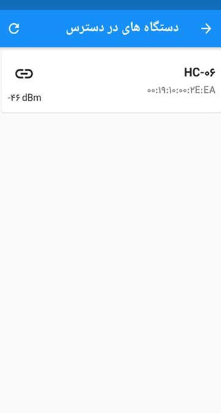
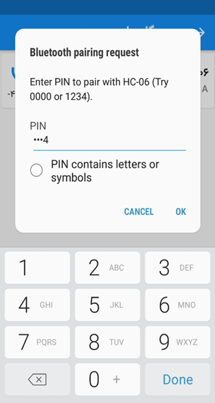
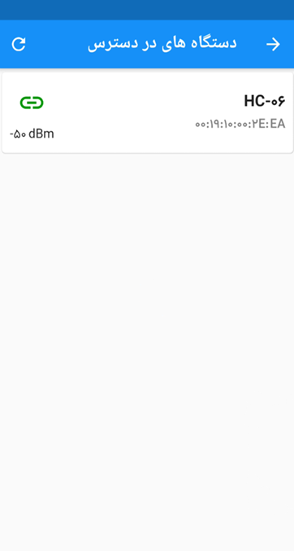

# **PITA: BalanceBot**

**PITA** is a simple two-wheeled self-balancing robot that can be controlled via an Android app. It uses an Arduino to control the motors and sensors, and the Android app is made using Flutter to move and rotate the bot.
I built this project as part of my bachelor's program in 2020.

## Overview

The **PITA** uses a PID controller to keep itself balanced. The PID controller constantly measures the angle of the robot using the MPU6050 sensor. If the bot tilts forward or backward, the PID controller adjusts the speed of the motors to bring the bot back to its upright position. This makes sure the robot doesn’t fall over and stays balanced while stationary or moving.

### Controlling the Movement

To make the robot move forward or backward, we change the balance point of the robot by slightly shifting it away from its center of mass. When the bot starts to "fall" in one direction, the controller tries to bring it back to balance, which results in forward or backward movement. Essentially, the robot is constantly falling and correcting itself, making it move.

For turning, the robot doesn't need to tilt. Instead, we control the speed of each wheel. To turn left, we slow down the left wheel and to turn right, we slow down the right wheel. This difference in wheel speeds causes the robot to rotate in the desired direction.

## Parts Used

- Aluminium plates and screw rods (for the frame)
- Arduino UNO
- MPU6050 module (Gyroscope and Accelerometer)
- L298N module (Motor Driver)
- DC Motors with gearbox
- HC-06 Bluetooth module

## Images

### Bot overview

    
    
<em>Figure 1. Bot overview (at development time)</em>

### Remote control

    

        
        
        
    

    

        
        
        
    

    
<em>Figure 2. Remote control application</em>

